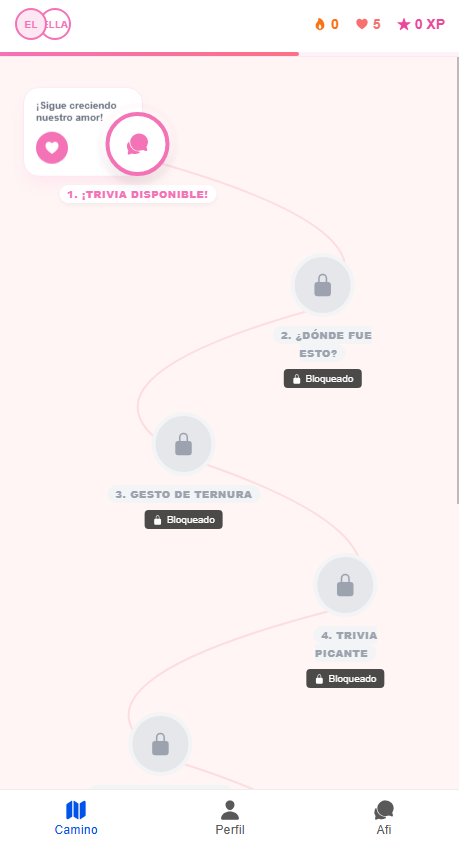
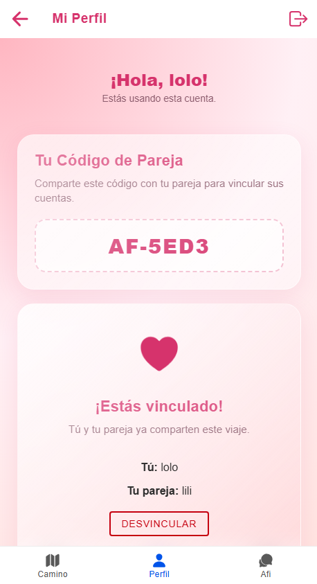
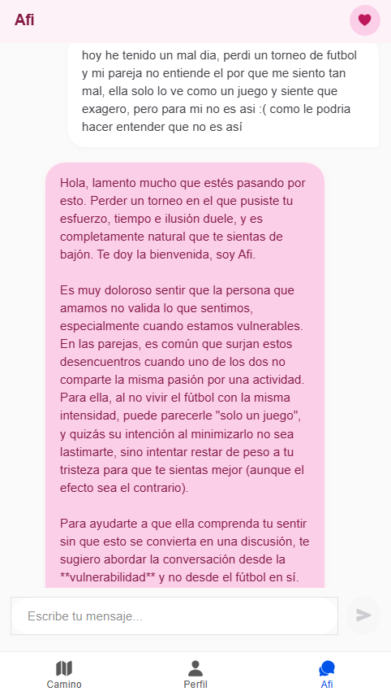

<h1 align="center">💖AffiniScore_Project💖</h1>

  

  

  
  
  

  

---
## 💌 Índice

- [💖 ¿Qué es AffiniScore?](#-qué-es-affiniscore)
- [🎯 Nuestro objetivo](#-nuestro-objetivo)
- [📱 Capturas del Proyecto](#-capturas-del-proyecto)
- [🌟 Funcionalidades](#-funcionalidades)
- [🫶 Tecnologías](#-tecnologías)
- [👥 Equipo](#-equipo)

---
## 💌 ¿Qué es AffiniScore?

  

AffiniScore es una aplicación móvil diseñada para fortalecer el vínculo entre parejas y evitar la monotonía mediante la gamificación. Nuestro objetivo es transformar las interacciones cotidianas en una experiencia dinámica, interactiva y gratificante.

---
## 🎯 Nuestro objetivo
Actualmente, muchas aplicaciones enfocadas en relaciones de pareja sufren de una baja retención de usuarios. Esto ocurre debido a la falta de incentivos o motivaciones sostenibles a largo plazo.

Nuestra misión es revertir esta tendencia ofreciendo una plataforma que promueva la participación constante y el crecimiento continuo de la relación.

---
## 📱 Capturas del Proyecto

  
  
  

---
## 🌟 Funcionalidades
💖 Sistema de puntos para parejas  
🎯 Misiones diarias interactivas  
✨ Gamificación de relaciones  
🫶 Tienda de recompensas  
📱 Experiencia móvil moderna  
🤖 Terapia virtual asistida

---
## 🫶 Tecnologías

💖 <b>Frontend</b>  

  

---

☁️ <b>Backend y Cloud</b>  

  

---

🧠 <b>Inteligencia Artificial</b>  

---
## 👥 Equipo

<h2 align="center">👥 Equipo</h2>

<table align="center">
<tr>

<td align="center" width="300">

### 🖤 Alonso Esteban Robles Franchis

🗄️ DBA  
📊 Analista Funcional  
🧪 QA

</td>

<td align="center" width="300">

### 💖 Karen Andrea Santibañez Quezada

🧪 Testing  
🎨 Diseñadora  
💻 Frontend

</td>

</tr>
</table>

---
<h3 align="center">
💖 Creciendo juntos con tecnología ✨
</h3>

  Desarrollado por Academia Tecnológica Triskeledu + DUOC UC

