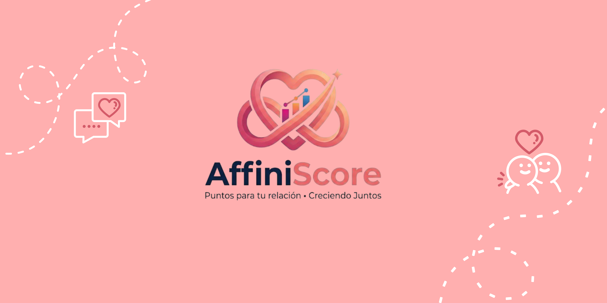

# AffiniScore_Project

  

 
### **Sobre el proyecto**
AffiniScore es una aplicación móvil diseñada para fortalecer el vínculo entre parejas y evitar la monotonía mediante la gamificación. Nuestro objetivo es transformar las interacciones cotidianas en una experiencia dinámica, interactiva y gratificante.

### **¿Por qué AffiniScore?**
Actualmente, muchas aplicaciones enfocadas en relaciones de pareja sufren de una baja retención de usuarios. Esto ocurre debido a la falta de incentivos o motivaciones sostenibles a largo plazo.

Nuestra misión es revertir esta tendencia ofreciendo una plataforma que promueva la participación constante y el crecimiento continuo de la relación.

### **Características Principales**
Para asegurar un alto nivel de compromiso, AffiniScore integra elementos clave de gamificación:

**Misiones Diarias:** Retos diseñados para fomentar la interacción constante.

**Trivias Personalizadas:** Dinámicas para conocerse mejor y profundizar el vínculo.

**Sistema de Puntos y Progreso:** Un mecanismo de recompensa que permite visualizar el fortalecimiento de la relación a través del tiempo.

